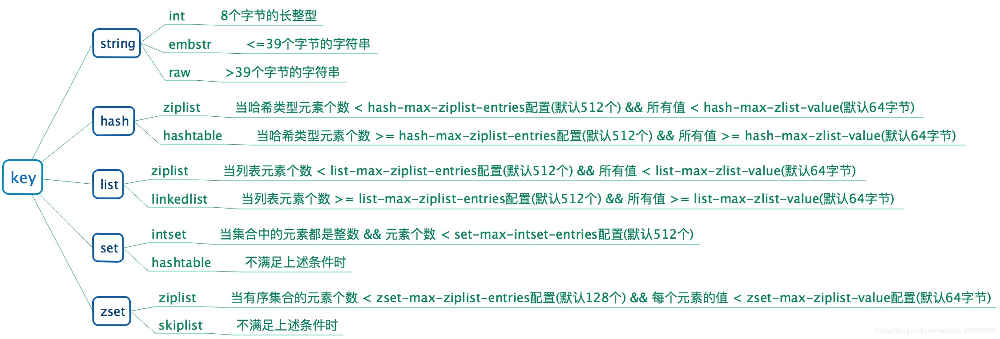

### redis篇：

#####1.有很多问题会被问哦，参考《redis设计与实现》

##### 2.redis一致性hash, hash环。

  https://zhuanlan.zhihu.com/p/34985026

    3.讲讲哨兵模式
    了解清楚了哨兵模式的原理，需要进行复习，做一些面试题，然后总结输出 2019.11.10 
    4.aof和rdb, 说说区别
    5.说说redis的基础数据结构，跳表的实现
    6.redis的过期策略。
    7.Redis 的 ZSET 做排行榜时，如果要实现分数相同时按时间顺序排序怎么实现？ 说了一个将 score 拆成高 32 位和低 32 位，高 32 位存分数，低 32 位存时间的方法。问还有没有其他方法，想不出了
    
    8.redis 持久化有哪几种方式，怎么选？
    https://www.jianshu.com/p/bedec93e5a7b
    redis是内存型数据库，数据也是可以落盘的。
    1.rdb持久化：在指定的时间间隔能对数据进行快照存储。
        特点：安全性差，文件尺寸较小，恢复速度较快， 是正常时期数据备份以及master-slave数据同步的最佳手段。 
        优点：使用单独子进程来进行持久化，主进程不会进行任何IO操作，保证了redis的高性能
        缺点：RDB是间隔一段时间进行持久化，如果持久化之间redis发生故障，会发生数据丢失，数据的准确性不高。   
    2.aof持久化：记录每次对服务器写的操作,当服务器重启的时候会重新执行这些命令来恢复原始的数据,AOF命令以redis协议追加保存每次写的操作到文件末尾
        特点：安全性高，可将数据及时同步到文件中，需要较多io，尺寸较大，恢复速度较慢，但是完整。
        优点：可以保持更高的数据完整性，因此已成为主流的持久化方案
        缺点：AOF文件比RDB文件大，且恢复速度慢。
    
    平时redis实例就打开aof，主从同步就用rdb.
    
    详解：
    1.rdb持久化：
        1.功能：把redis在内存中的状态数据保存到磁盘中。
        2.执行方式：
            1.可手动执行。
            2.也可在redis.conf中配置，定期执行。 
        3.文件： rdb持久化产生的rdb文件是一个压缩过的二进制文件，保存在硬盘中。
        4.生成方式：
            1.save： 阻塞redis服务器进程，知道rdb文件创建完毕。
            2.bgsave: 派生一个子进程来创建rdb文件，记录bgsave当时的数据库状态。，搞定后，子进程会发信号给父进程，父进程也是会轮询接受子进程信号。
        4.重新redis,自动载入rdb文件。若开启了aof持久化，先加载aof文件。
        5.rdb,保存键值， cpoy on write模式，每次都是全量的备份。
    
        RDB：在指定的时间间隔能对数据进行快照存储。

    2.aof持久化
        1.备份数据库接收到的命令，追加到文件中。
        2.redis默认每隔一秒写入aof文件。
        3.redis创建一个client, 把aof的命令全部执行一遍。
        4.问题，子进程在处理，主进程又被修改，会发生不一致的问题，因此，会有一个aof 缓冲区 和aof重写缓冲区，等aof重写完，然后把aof重写缓冲区的内容写入aof.
    
    9.redis 主从同步是怎样的过程？
    Redis主从复制分为全量同步和增量同步.
    1.全量同步：
        时期：slave初始化阶段，把master上的数据全部复制一遍。
        过程：
            1.slave连接master, 发送sync命令。
            2.master接收到sync，bgsave生成rdb文件，并使用缓冲区记录执行此后的所有写命令。
            3.master bgsave执行完。发送快照文件到slave,  发送期间继续记录被执行命令。
            4.slave收到快照文件，丢弃旧数据。载入快照。
            5.master发送快照完毕后，开始发送缓冲区写命令。
            6.slave载入完毕后，开始接受命令请求，并执行master发送过来的缓冲区写命令。
    2.增量同步：
        slave初始化开始正常工作后，master发生的写操作同步到slave的过程。master每一次执行写操作都会同步到slave。
    
    10.redis的 zset 怎么实现的？ 尽量介绍的全一点，跳跃表加哈希表以及压缩列表
    http://redisbook.com/preview/object/sorted_set.html
    1.两种编码: 压缩列表（ziplist）、跳跃表（zskiplist）
    2.编码选择ziplist标准,不满足条件zskiplist，当有序集合不满足以下条件，程序是会自动编码转化：
        1.有序集合保存的元素数量小于 128 个
        2.有序集合保存的所有元素成员的长度都小于 64 字节；
    3.实现：
        为了让有序集合的查找和范围型操作都尽可能快地执行， Redis 选择了同时使用字典和跳跃表两种数据结构来实现有序集合
        压缩列表编码：
            每个集合元素使用两个紧挨在一起的压缩列表节点来保存， 第一个节点保存元素的成员（member）， 而第二个元素则保存元素的分值（score）。
            压缩列表内的集合元素按分值从小到大进行排序， 分值较小的元素被放置在靠近表头的方向， 而分值较大的元素则被放置在靠近表尾的方向。
        跳跃表编码：
            实现就是zset由一个字典（hash表）+跳跃表
            1.hash表和跳跃表之间是会共享集合元素的。
            2.利用hash表，能够非常快速查找元素。O(1), 但是无序，只能靠跳跃表来保持有序。
            3.利用跳跃表能够进行zrank,zrange等操作。
    
    11.redis key 的过期策略和内存淘汰策略
    1.过期策略：
        1.定时过期：每个设置过期的key都会有一个定时器，定时去清除
          优点：对内存是很友好的
          缺点：浪费cpu资源去处理过期数据，影响缓存的响应时间和吞吐量。
        2.惰性过期：只有当访问一个key时，才会判断该key是否已过期。
          优点：节省cpu资源。
          缺点：占用内存。
        3.定期过期：每隔一定时间，就去扫描数据库中expires字典中一定数量的key, 并清除过期的key。
    
        redis 主要使用惰性过期，定期过期两种。
    2.内存淘汰策略：
        在Redis的用于缓存的内存不足时，怎么处理需要新写入且需要申请额外空间的数据。
        当内存不足以容纳新写入数据时，
        1.noeviction：新写入操作会报错。 默认
        2.allkeys-lru：在键空间中，移除最近最少使用的key。
        3.allkeys-random：在键空间中，随机移除某个key。
        4.volatile-lru：在设置了过期时间的键空间中，移除最近最少使用的key。
        5.volatile-random：在设置了过期时间的键空间中，随机移除某个key。
        6.volatile-ttl：在设置了过期时间的键空间中，有更早过期时间的key优先移除。
    
    12.redis数据结构有哪些？分别怎么实现的?
    https://www.jianshu.com/p/f8ccf8806095
    1.数据结构：
        1.简单动态字符串
            struct sdsdr{
                // 字符串长度
                int lenl ;
                //记录buf数组空闲长度
                int free;
                //字节数组，用于保存字符串
                char buf[];
            }
            sds优点：
            1.常数复杂度获取字符串长度
            2.杜绝缓冲区溢出
            3.减少字符串长度所需的内存重分配次数，<= O(N)
            4.二进制安全，c语言会识别特殊格式字符为结束符 '\0'
            5。保留'\0'，就是为了兼容部分c字符串中函数
    
        2.双向链表
            //链表节点类型
            typedef struct listNode { 
                struct listNode * prev; 
                struct listNode * next;
                void * value; 
            }listNode;
    
            //链表类型
            typedef struct list { 
                //表头节点
                listNode * head; 
                //表未节点,方便逆向遍历
                listNode * tail; 
                //节点数目, 优化链表求长度
                unsigned long len;    
            }list;
    
        3.hash表
            跟java的hashmap差不多。
            typedef struct dictht{
                //hash表数组
                dictEntry ** table;
                //hash表数组长度
                unsigned long size; 
                //用于计算索引的掩码 总是等于size-1
                unsigned long sizemask;
                //真正存储的键值对数量
                unsigned long used; 
            } dictht;
    
            typedef struct dictEntry { 
                //键 
                void *key; 
                //值 
                union{ 
                    void *val; 
                    uint64_ tu64; 
                    int64_ ts64; 
                } v;
                //指向下一个节点的指针
                struct dictEntry *next; 
            } dictEntry;
    
            字典包含ht[0] ht[1],平时都是用ht[0], 只有rehash, 才会用到ht[1]
            redis采用了渐进式rehash,就是同时维护两个hash表hd[0]和hd[1],设置rehash_idx设置为0，在0< rehash_idx < 槽位数组长度时, 对hash表的任何操作除了执行正常的操作过程以外，还会将hd[0]槽位数组rehash_idx索引上的所有键值对rehash到hd[1],这
            个过程中的查找会同时使用两个表进行操作,同时所有的添加键值对操作只会在hd[1]上进行,保证了hd[0]只减不增。rehash完成后,hash表指针指向hd[1],释放hd[0]内存。
    
        4.跳跃表
        5.整数集合
            实际上就是有序无重复的数组, 可以通过二分法进行查找操作
        6.压缩列表
            压缩列表是Redis为了节约内存而开发的, 是由一系列特殊编码的连续内存块组成的顺序型数据结构,每个压缩列表节点可以保存一个字节数组或一个整数值。其由三部分构成,如下所示:
             ----------------------------------------
            | prev_entry_length | encoding | content |
            -----------------------------------------
            其中content为实际数据,encoding存储了content的具体数据类型,prev_entry_length则保存了前一个节点的占用的内存长度,通过这个值就可以定位到前一个节点。在压缩列表中为了节省内存可能会造成连锁更新,因此存在一定的性能隐患,但是由于本身出现的概率就比较小,在节点数量不多的情况下这种影响可以忽略不计。
    
    2. 数据类型：
        1.string类型
            String类型在Redis底层可以是int,raw和embstr,（普通的k-v存储）
        2.list类型
            List类型在Redis底层可以是ziplist(压缩列表)或linkedlist(双向列表)。
        3.hash类型
            Hash类型在Redis底层可以是ziplist(压缩列表)或hashtable(Hash表),ziplist编码的哈希对象每当 有新的键值对要插入时,会将保存了键和值的节点依次推入到压缩列表表尾,因此同一键值对顺序存放在一起。
        4.set类型
            Set类型在Redis底层可以是intset(整数集合)或hashtable(Hash表),只有当Set中的所有元素均为整数类型时才会使用intset。
        5.zset类型
            Zset类型在Redis底层可以是ziplist(压缩列表)或skiplist(跳跃表)。
    
    13.Redis到底是多线程还是单线程？线程安全吗?
    redis是单线程，线程安全
    redis可以能够快速执行的原因：
        (1) 绝大部分请求是纯粹的内存操作（非常快速），因此瓶颈在io
        (2) 采用单线程,避免了不必要的上下文切换和竞争条件
        (3) 非阻塞IO - IO多路复用
        redis内部实现采用epoll，采用了epoll+自己实现的简单的事件框架。epoll中的读、写、关闭、连接都转化成了事件，然后利用epoll的多路复用特性，绝不在io上浪费一点时间 
    
    14.redis集群？
    
    15.redis 哨兵模式（todo）
    
    16.MySQL里有2000w数据，redis中只存20w的数据，如何保证redis中的数据都是热点数据？
      redis内存数据集大小上升到一定大小的时候，就会施行数据淘汰策略
    
    17.redis何时触发淘汰数据的动作
      一个客户端执行指令，导致数据的增加时。
      Redis检测到内存的使用已经达到上限。
      Redis自身执行指令时
      补充：Redis为了避免反复触发淘汰策略，每次会淘汰掉一批数据。
    
    18.Redis相比memcached有哪些优势？
        memcached所有的值均是简单的字符串，redis作为其替代者，支持更为丰富的数据类型
        redis可以持久化其数据

##### 19.redis的对外数据结构

string（字符串）

hash（哈希）

list（列表）

set（集合）

zset（有序集合）

Embstr：embstr编码的简单动态字符串(sds)，针对短字符串优化编码的方式，只需一次内存分配

raw：简单动态字符串，需要两次内存分配，redisObject和sdshdr

ziplist: 压缩列表

inset: 整数列表

Skiplist: 跳表+字典（两个hashtable组成，一个hashtable有值，一个为空，做rehash用）

Hashtable: 哈希表

Linkedlist: 双向链表

##### 20.渐进式hash

哈希表有个负载因子，如果哈希表保存的键值太多或者太少，程序就会rehash，收缩或者扩展。

负载因子=哈希表保存的节点数/哈希表的大小

如果负载因子>1 ,那么就进行rehash了。

这个rehash的过程是渐进式的。慢慢来，不要急。

步骤：

1.设置索引计数器变量rehashidx=0

2.rehash期间，每次对字典进行增删改查后(rehashidx=哈希值，也就是hashtable的数组下标， 0，1，2，3.。。)， 都会把对应的rehashidx索引上的链表的键值对rehash到新的ht[1]

3.等到所有的键值对操作完了，就把rehashidx=-1

4.rehash期间，ht[0]不再进行增加，ht[1]接受新增元素。ht[0]只减不增，所有操作都会执行两边。

