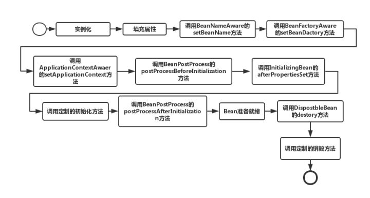
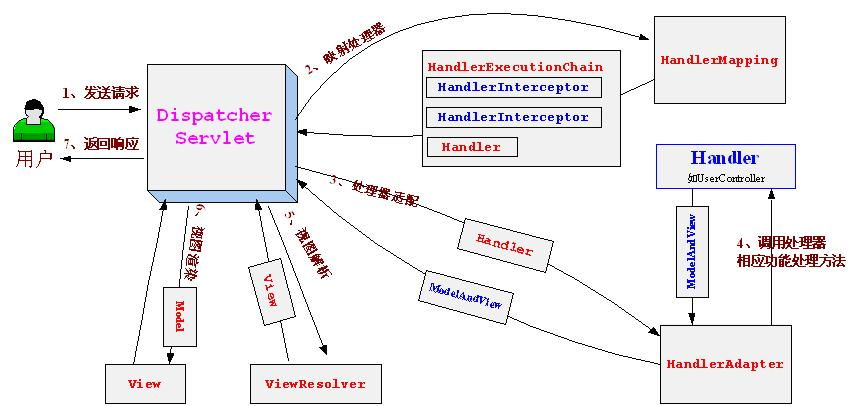

#### Spring

想成为一名合格的 Java 后端工程师，最新Spring5的新特性、Spring5源码的构建、Springbean的生命周期、Spring循环依赖的源码设计、Spring扩展或者二次开发的原理、主流开源框架如何配合Spring特点等问题都必须要牢牢掌握。

##### 1.Bean的作用域：

    1.singleton：单例模式，Spring IoC容器中只会存在一个共享的Bean实例，无论有多少个Bean引用它，始终指向同一对象。
    2.prototype：原型模式，每次通过Spring容器获取prototype定义的bean时，容器都将创建一个新的Bean实例，每个Bean实例都有自己的属性和状态。
    3.request：在一次Http请求中，容器会返回该Bean的同一实例。而对不同的Http请求则会产生新的Bean，而且该bean仅在当前Http Request内有效。
    4.session：在一次Http Session中，容器会返回该Bean的同一实例。而对不同的Session请求则会创建新的实例，该bean实例仅在当前Session内有效。
    5.global Session：在一个全局的Http Session中，容器会返回该Bean的同一个实例，仅在使用portlet context时有效。

##### 2.IOC（DI）    

    1.控制反转
        由 Spring IOC 容器来负责对象的生命周期和对象之间的关系。IoC 容器控制对象的创建，依赖对象的获取被反转了
        没有 IoC 的时候我们都是在自己对象中主动去创建被依赖的对象，这是正转。但是有了 IoC 后，所依赖的对象直接由 IoC 容器创建后注入到被注入的对象中，依赖的对象由原来的主动获取变成被动接受，所以是反转.

##### 3.什么是Spring框架，Spring框架有哪些主要模块？4.使用Spring框架能带来哪些好处？

##### 5.mybatis源码当中利用了Spirng 的那些扩展？mybatis扩展Spring之后有哪些问题是无法解决的？
6.在Java中依赖注入有哪些方式？
7.eureka源码当中如何扩展的Spring？
8.Spring提供几种配置方式来设置元数据？Spring提供哪些配置形式？

##### 9.请解释Spring Bean的生命周期

##### 10.Spring容器当中包含了哪些常用组件，作用是什么，场景是什么？

##### 11.MyBatis 与 Hibernate 的区别是什么？MyBatis 如何实现模糊查询?
12.Nginx 反向代理实现高并发的具体步骤是什么？Nginx 搭建 Tomcat 集群的核心配置应该怎么写？

##### 13.AOP的底层实现原理

https://juejin.im/post/5b90e648f265da0aea695672

https://blog.csdn.net/fly910905/article/details/78641475

jdk动态代理，需要目标对象实现接口。

CgLib代理，不需要目标对象实现接口，spring会自动在JDK动态代理和CGLIB之间转换。

Spring AOP基于注解配置的情况下，需要依赖于AspectJ包的标准注解，但是不需要额外的编译以及AspectJ的织入器，而基于XML配置不需要，所以Spring AOP只是复用了AspectJ的注解，并没有其他依赖AspectJ的地方。

##### 14.静态代理和动态代理的区别？动态代理是怎么实现的？

***静态代理***：代理类在编译阶段生成，程序运行前就已经存在，那么这种代理方式被成为静态代理，这种情况下的代理类通常都是我们在Java代码中定义的。
***动态代理***：代理类在程序运行时创建，也就是说，这种情况下，代理类并不是在Java代码中定义的，而是在运行时根据我们在Java代码中的“指示”动态生成的。

目前，静态代理主要有AspectJ静态代理、JDK静态代理技术、而动态代理有JDK动态代理、Cglib动态代理技术，而Spring Aop是整合使用了JDK动态代理和Cglib动态代理两种技术，下面我们结合实例一步一步介绍所有的概念。

##### 15、BeanFactory 和 FactoryBean？

BeanFactory是个Factory，也就是IOC容器或对象工厂，FactoryBean是个Bean。

ApplicationContext、xmlBeanFactory、de faultlistenerbeanfactory都是实现了be anfactory接口。

在Spring中，所有的Bean都是由BeanFactory(也就是IOC容器)来进行管理的。但对FactoryBean而言，这个Bean不是简单的Bean，而是一个能生产或者修饰对象生成的工厂Bean,它的实现与设计模式中的工厂模式和修饰器模式类似.

如果想获取获取 factoryBean 实例对象 ，通过 ge tBean("&beanname")

https://blog.csdn.net/qiesheng/article/details/72875315

##### 16、Spring IOC 的理解，其初始化过程？

Ioc:让你脱离对依赖对象的维护，只需要随用随取，不需要关心依赖对象的任何过程。

自动注入对象，涉及到对象的构建和绑定。

ioc容器： beanFactory 和 ApplicationContext两种容器对bean的管理

https://blog.csdn.net/chenssy/article/details/82343456

##### 17、BeanFactory 和 ApplicationContext？

​	beanfactory ioc容器，创建管理bean, BeanDefinition是其基本结构，内部维护一个map。无法支持aop,web应用。

重点：当我们使用BeanFactory去获取Bean的时候，我们只是实例化了该容器，而该容器中的bean并没有被实例化。当我们getBean的时候，才会实时实例化该bean对象。

​	applicationContext继承beanFactory, 应用上下文，有着更多的功能，当我们使用ApplicationContext去获取bean的时候，在加载XXX.xml的时候，会创建所有的配置bean。

​	1.提供国际化的标准访问策略

​	2.提供强大的事件机制

​	3.扩展了reourceLoader, 可加载多个resource，访问不同资源。

​	4.对web应用支持。

 区别总结
	1.如果使用ApplicationContext，如果配置的bean是singleton，那么不管你有没有或想不想用它，它都会被实例化。好处是可以预先加载，坏处是浪费内存。
	2.BeanFactory，当使用BeanFactory实例化对象时，配置的bean不会马上被实例化，而是等到你使用该bean的时候（getBean）才会被实例化。好处是节约内存，坏处是速度比较慢。多用于移动设备的开发。
	3.没有特殊要求的情况下，应该使用ApplicationContext完成。因为BeanFactory能完成的事情，ApplicationContext都能完成，并且提供了更多接近现在开发的功能。

##### 18、Spring Bean 的生命周期，如何被管理的？

https://www.zhihu.com/question/38597960

1.Spring对Bean进行实例化（相当于程序中的new Xx()）

2.Spring将值和Bean的引用注入进Bean对应的属性中

3.如果Bean实现了BeanNameAware接口，Spring将Bean的ID传递给setBeanName()方法
**（实现BeanNameAware清主要是为了通过Bean的引用来获得Bean的ID，一般业务中是很少有用到Bean的ID的**）

4.如果Bean实现了BeanFactoryAware接口，Spring将调用setBeanFactory(BeanFactory bf)方法并把BeanFactory容器实例作为参数传入。
**（实现BeanFactoryAware 主要目的是为了获取Spring容器，如Bean通过Spring容器发布事件等）**

5.如果Bean实现了ApplicationContextAwaer接口，Spring容器将调用setApplicationContext(ApplicationContext ctx)方法，把y应用上下文作为参数传入.
**(作用与BeanFactory类似都是为了获取Spring容器，不同的是Spring容器在调用setApplicationContext方法时会把它自己作为setApplicationContext 的参数传入，而Spring容器在调用setBeanDactory前需要程序员自己指定（注入）setBeanDactory里的参数BeanFactory )**

6.如果Bean实现了BeanPostProcess接口，Spring将调用它们的postProcessBeforeInitialization（预初始化）方法
**（作用是在Bean实例创建成功前对进行增强处理，如对Bean进行修改，增加某个功能）**

7.如果Bean实现了InitializingBean接口，Spring将调用它们的afterPropertiesSet方法，作用与在配置文件中对Bean使用init-method声明初始化的作用一样，都是在Bean的全部属性设置成功后执行的初始化方法。

8.如果Bean实现了BeanPostProcess接口，Spring将调用它们的postProcessAfterInitialization（后初始化）方法
**（作用与6的一样，只不过6是在Bean初始化前执行的，而这个是在Bean初始化后执行的，时机不同 )**

9.经过以上的工作后，Bean将一直驻留在应用上下文中给应用使用，直到应用上下文被销毁

10.如果Bean实现了DispostbleBean接口，Spring将调用它的destory方法，作用与在配置文件中对Bean使用destory-method属性的作用一样，都是在Bean实例销毁前执行的方法。

##### 19、Spring Bean 的加载过程是怎样的？

通过 `ResourceLoader`和其子类`DefaultResourceLoader`完成资源文件位置定位，实现从类路径，文件系统，url等方式定位功能，完成定位后得到`Resource`对象，再交给`BeanDefinitionReader`，它再委托给`BeanDefinitionParserDelegate`完成bean的解析并得到`BeanDefinition`对象，然后通过`registerBeanDefinition`方法进行注册，IOC容器内维护了一个HashMap来保存该`BeanDefinition`对象，Spring中的`BeanDefinition`其实就是我们用的`JavaBean`。

https://juejin.im/post/5d3fad9ce51d4561f40adce3

#####20、如果要你实现Spring AOP，请问怎么实现？

​	jdk动态代理，被代理对象需要实现目标接口，proxy.newProxyInstance()

​	cglib动态代码，不需要实现目标接口，动态生成一个子类，子类方法覆盖父类方法，但是final方法没办法重写。

Spring AOP

       Spring AOP采用的是动态代理，在运行期间对业务方法进行增强，所以不会生成新类，对于动态代理技术，Spring AOP提供了对JDK动态代理的支持以及CGLib的支持。
    
       JDK动态代理只能为接口创建动态代理实例，而不能对类创建动态代理。需要获得被目标类的接口信息（应用Java的反射技术），生成一个实现了代理接口的动态代理类（字节码），再通过反射机制获得动态代理类的构造函数，利用构造函数生成动态代理类的实例对象，在调用具体方法前调用invokeHandler方法来处理。
    
       CGLib动态代理需要依赖asm包，把被代理对象类的class文件加载进来，修改其字节码生成子类。
    
       但是Spring AOP基于注解配置的情况下，需要依赖于AspectJ包的标准注解，但是不需要额外的编译以及AspectJ的织入器，而基于XML配置不需要。
————————————————

原文链接：https://blog.csdn.net/L_BestCoder/java/article/details/79321631

##### 21、如果要你实现Spring IOC，你会注意哪些问题？

##### 22、Spring 是如何管理事务的，事务管理机制？

​	基于 @Transactional 的方式将声明式事务管理简化到了极致。开发人员只需在配置文件中加上一行启用相关后处理 Bean 的配置，然后在需要实施事务管理的方法或者类上使用 @Transactional 指定事务规则即可实现事务管理，而且功能也不必其他方式逊色。

##### 23、Spring 的不同事务传播行为有哪些，干什么用的？

https://juejin.im/entry/5a8fe57e5188255de201062b

​	主要用到三个：

​		propagation_request:	如果当前没有事务，就新建一个事务，如果已经存在一个事务中，加入到这个事务中。这是最常见的选择。

**在外围方法开启事务的情况下Propagation.REQUIRED修饰的内部方法会加入到外围方法的事务中，所有Propagation.REQUIRED修饰的内部方法和外围方法均属于同一事务，只要一个方法回滚，整个事务均回滚。**

​		propagation_request_new：新建事务，如果当前存在事务，把当前事务挂起。

**在外围方法开启事务的情况下Propagation.REQUIRES_NEW修饰的内部方法依然会单独开启独立事务，且与外部方法事务也独立，内部方法之间、内部方法和外部方法事务均相互独立，互不干扰。**

​		propagation_nested：如果当前存在事务，则在嵌套事务内执行。如果当前没有事务，则执行与PROPAGATION_REQUIRED类似的操作。

**外围方法开启事务的情况下Propagation.NESTED修饰的内部方法属于外部事务的子事务，外围主事务回滚，子事务一定回滚，而内部子事务可以单独回滚而不影响外围主事务和其他子事务**

##### 24、Spring 中用到了那些设计模式？

​	单例，代理，装饰，注册

##### 25、Spring MVC 的工作原理？

1、  首先用户发送请求——>DispatcherServlet，前端控制器收到请求后自己不进行处理，而是委托给其他的解析器进行处理，作为统一访问点，进行全局的流程控制；

2、  DispatcherServlet——>HandlerMapping， HandlerMapping将会把请求映射为HandlerExecutionChain对象（包含一个Handler处理器（页面控制器）对象、多个HandlerInterceptor拦截器）对象，通过这种策略模式，很容易添加新的映射策略；

3、  DispatcherServlet——>HandlerAdapter，HandlerAdapter将会把处理器包装为适配器，从而支持多种类型的处理器，即适配器设计模式的应用，从而很容易支持很多类型的处理器；

4、  HandlerAdapter——>处理器功能处理方法的调用，HandlerAdapter将会根据适配的结果调用真正的处理器的功能处理方法，完成功能处理；并返回一个ModelAndView对象（包含模型数据、逻辑视图名）；

5、  ModelAndView的逻辑视图名——> ViewResolver， ViewResolver将把逻辑视图名解析为具体的View，通过这种策略模式，很容易更换其他视图技术；

6、  View——>渲染，View会根据传进来的Model模型数据进行渲染，此处的Model实际是一个Map数据结构，因此很容易支持其他视图技术；

7、返回控制权给DispatcherServlet，由DispatcherServlet返回响应给用户，到此一个流程结束。

##### 26、Spring 循环注入的原理？

https://blog.csdn.net/jijianshuai/article/details/78122738

主要看bean的作用范围：

​	singletion单例：

​		1.构造器，不行，需要等待彼此创建，失败

​		2.setter()方法，可以，以为spring容器对单例对象有缓存，可以构造成功，提前报露对象出来，后续再setter。

​	prototype范围：

​		直接报错，不存在缓存，无法创建bean。

##### 27、Spring 如何保证 Controller 并发的安全？

SpringMVC 中的 controller 默认是单例的，那么如果不小心在类中定义了类变量，那么这个类变量是被所有请求共享的，这可能会造成多个请求修改该变量的值，出现与预期结果不符合的异常。所以如上所述，属性变量会到值线程安全问题，解决方法包括使用 threadLocal 或不使用属性变量、配置为多例均可（加锁控制效率不行）
。

只需要在类上添加注解@Scope("prototype")即可，这样每次请求调用的类都是重新生成的（每次生成会影响效率）

