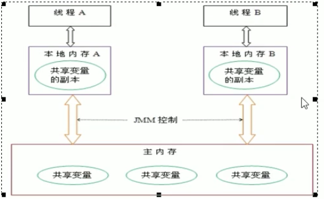
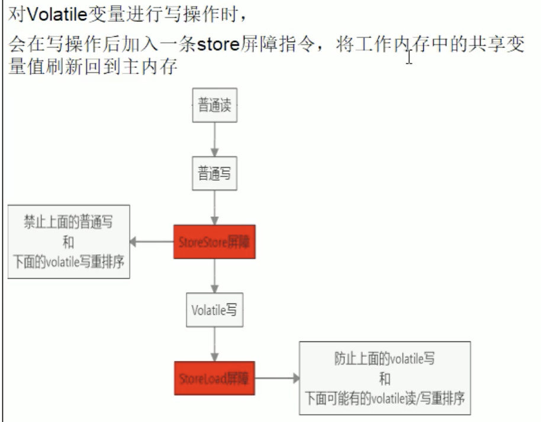
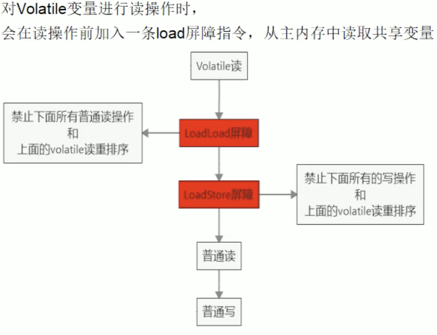
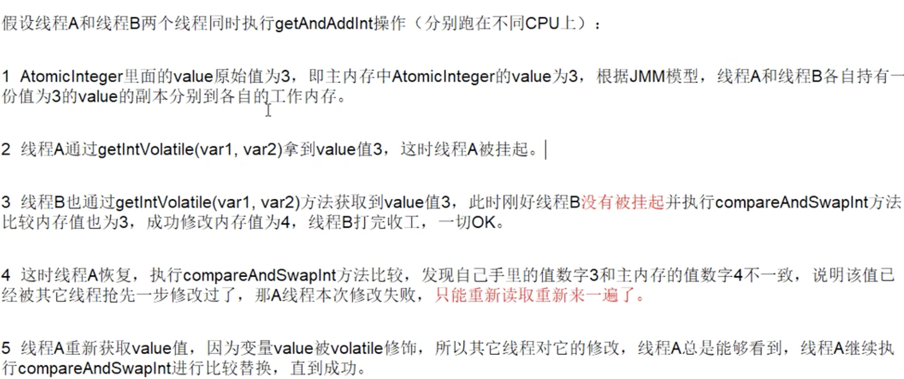
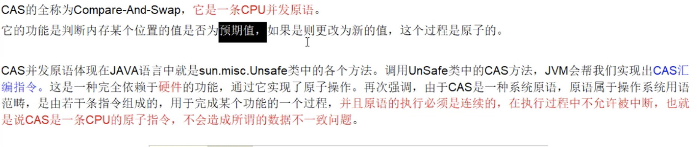
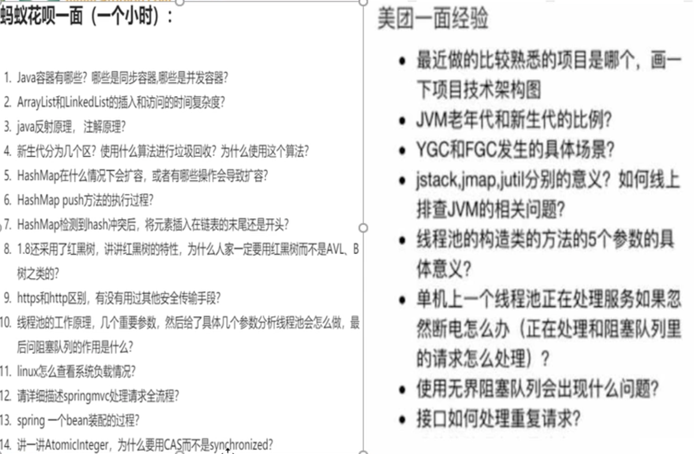
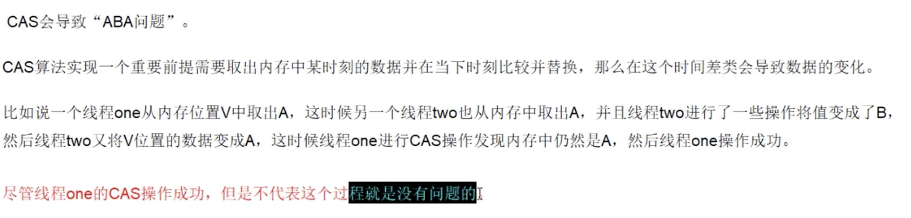
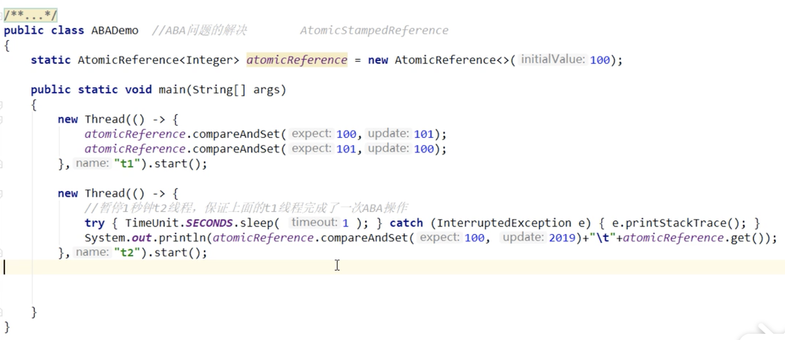

# java多线程面试

## 1.谈谈对volatile的理解

​	**1.1 java虚拟机提供的轻量级的同步机制**

​			轻量级，说白了就是乞丐版synochronized, 哈哈哈哈

​			1.1.1 **保证可见性**，可见性就是，某个线程主内存的值，然后其他线程马上知道，这就是可见性。

​			1.1.2 **不保证原子性**，假设有三个线程来执行n++操作，a,b,c三个线程分别获区了n=0的值，然后在各自的工作区域内进行++操作，++操作在汇编层是有三个指令，当a的++操作未执行完成，就被挂起，cpu执行了其他线程的写入值到主内存中，然后在volatile通知可见性时，a线程获取资源，又把++结果为1的值再次覆盖上主内存的值，导致了相加的数值不对。	

​			解决方法：

​			使用原子处理类 java.util.concurrent.atomic

​			使用AtomicInteger、AtomicLong、AtomicBoolean、AtomicReference			

​			1.1.3 **禁止指令重排**	

​	**1.2 聊聊JMM（java内存模型）**

​		**1.2.1 可见性**

​		抽象的概念，实际并不存在，描述一组规则或规范，通过这组规范定义了程序中各个变量（包括实例字段，静态字段和构成数组对象的元素）的访问方式。

​		JMM关于同步的规范：

​		1）线程解锁前，必须把共享变量的值刷新回主内存。

​		2）线程加锁前，必须读取主内存的最新值到自己的工作内存中。

​		3） 加锁解锁都是同一把锁。

​		由于JVM运行程序的实体是线程，而每个线程创建时Jvm都会为其常创建一个**工作内存（栈空间），工作内存是线程私有的**，其他线程无法访问到。

​		JMM规定所有变量都存储在主内存，主内存是线程共享的区域。

​		**重点： (保证可见性的机制)**

​		线程对于变量的操作（读写）必须在工作内存中操作完成，第一步，拷贝主内存中的最新变量值到自己工作内存中，然后进行操作，操作完成后，再把变量值写回主内存。不能直接操作主内存中的值。因此，每个工作内存中的都是主内存中变量的拷贝副本。

​		这就决定了 线程之间的通信需要通过主内存来完成。



​	**1.2.2 原子性**

​	**1.2.3 有序性**

​	涉及到了指令重排，计算机在执行程序是，为了提高性能，编译器和处理器常常会做指令重排，所以得到的执行顺序和我们代码写的顺序是不一样的。

​	源代码—> **编译器优化的重排**—>**指令并行的重排**—>**内存系统的重排**—> 最终执行的指令

​	单线程环境下确保程序最终执行结果和代码顺序执行的结果一致，处理器在进行重排序是必须要考虑指令之间的**数据依赖性**。（单线程不用担心指令重排）

​	多线程环境下，由于编译器优化重排，两个线程之间使用的变量就不一定能保证结果一致性了。


为了保证有序性，所以有时候要用到禁止指令重排优化。使用volatile修改的变量，变量前后禁止指令重排，线程在对其进行读写的时候，会产生内存屏障，使得对于改变量的读写顺序不会乱，读写完以后，数据会被强刷回主内存中，并且其他工作线程中的变量无效，实现了可见性。


**内存屏障，又称为内存栅栏，是一个cpu指令。有load屏障指令，store屏障指令**

作用：

		1. 保证特定操作的执行顺序。
  		2. 保证某些变量的内存可见性（利用该特性实现volatile的内存可见性）

由于编译器和处理器都有指令重排优化，在指令之间插入一条内存屏障，则会告诉编译器和cpu, 不管什么指令和这条 内存屏障 指令重排序， 也就是说

**通过插入内存屏障禁止在内存屏障前后的指令执行重排序优化。**

内存屏障另外作用是强制刷出各种cpu的缓存数据，保证任何cpu线程都能读取到这些数据的最新版本。


**写操作是，前后插入store屏障指令，起到内存屏障作用，防止指令重排。**



​	

​	**读操作是，插入load屏障指令**



## **1.3 哪里使用到volatile**

单例模式下，多线程可能会出现问题。实例被创建多次。

sychronized可以解决问题，但是太重了！不能为了数据一致性，使得并发效率降低，

//使用DCL（双端检锁机制），加锁前后两次检查，但是代码存在指令重排，所以双端检锁机制也不一定线程安全。

原因是在于某一个线程在执行到第一次检测是，读取到的instance不为null, instance的引用对象可能没有完全初始化。

instance = new SingleInstance(); 

实际为：

```
memory = allocate(); //1. 分配对象内存空间

instance(memory);  //2.初始化对象

instance = memory; //3.设置instance执行刚分配的内存地址，此时instance != null
```

由于步骤2 3不存在数据依赖关系，因此在单线程中可以进行指令重排，不影响执行结果。

```
memory = allocate(); //1. 分配对象内存空间

instance = memory; //3.设置instance执行刚分配的内存地址，此时instance != null

instance(memory);  //2.初始化对象
```

出现问题情况是 instance != null， 但是返回的对象为null，造成线程安全问题。

**对单例对象加volatile, 禁止指令重排，获取实实在在的对象，保证线程安全**


```
package juc;

public class SingleInstance {
    public static volatile  SingleInstance instance = null;

    public SingleInstance(){
        System.out.println(Thread.currentThread().getName()+" 构造方法");
    }

    public static SingleInstance getInstance(){
        //只是判断地址是不是为空
        if(null == instance){
            synchronized (SingleInstance.class){
                if(null == instance){
                    instance = new SingleInstance();
                }

            }

        }

        return instance;
    }


    public static void main(String[] args) {
        for (int i = 0; i < 20; i++) {
            new Thread(()->{
                SingleInstance.getInstance();
            },String.valueOf(i)).start();
        }
    }
}


```


# 2. 谈谈对CAS的理解，以及底层原理是什么？


1.Unsafe，是CAS的底层核心类，由于java方法无法直接访问底层系统，需要通过本地（native）方法来访问， Unsafe相当于一个后门，基于该类可以直接操作特定内存的数据。

unsafe存在于sun.misc包中，其内部方法操作可以像c的指针那样直接操作内存，因此java中的CAS操作的执行依赖于unsafe类方法。

2.变量valueOffSet，表示变量值在内存中的偏移地址，因为Unsafe就是根据内存偏移地址获取数据。意思就是this,给出了变量atomicInteger的首地址，然后+上偏移量，就能确定变量在主内存中的一段字节，然后就能算出值。

3.Atomicinteger 中也使用到了volatile修饰value, 保证了值在多线程中的可见性。


## 2.1 unsafe.getAndAddInt 

源码：

```
/**
     * Atomically increments by one the current value.
     *
     * @return the previous value
     */
    public final int getAndIncrement() {
        return unsafe.getAndAddInt(this, valueOffset, 1);
    }
```

```
public final int getAndAddInt(Object var1, long var2, int var4) {
        int var5;
        do {
            var5 = this.getIntVolatile(var1, var2); //1.主内存中获取的值
            //compareAndSwapInt(var1, var2, var5, var5 + var4) 2.原子性操作，cas，操作数据都是内存中的值。
        } while(!this.compareAndSwapInt(var1, var2, var5, var5 + var4));

        return var5;
    }
    
    
    多线程过程中，线程a执行了1操作，然后被挂起，线程b获取了值，然后执行cas操作，修改了值，等到线程a获取资源执行的时候，需要检查一下，执行操作2，检查，如果不一致，就再执行操作1，直到数据一致。

```

   


## 2.2 cas是什么?



说白了就是通过cpu的原子指令操作，然后do() while（）无限循环，使得获取的数据是最新值（工作内存的值与主内存的值保持一致，不一致的话，就从主内存中重新取），然后进行原子性的操作。


总结：

CAS：比较当前工作内存中的值和主内存中的值，如果相同则执行规定操作，否则继续比较，直到两者的值一致为止（自旋）

与synchronized比较，synchronized，保证一致性，并发性下降，cas 不加锁，保证一致性，加强并发性，但是需要多次比较。

缺点：

1.长期不成功，死循环，给cpu带来很大开销。

2.只能保证一个共享变量的原子操作。

3.引发ABA问题



 

# 3.原子类的AtomicInteger的ABA问题谈谈？原子更新引用知道吗？



如果不关心过程，只注意结果，那倒无所谓。

原子 引用是为了拓展原子类型，开发者可以定制特定的bean的原子类。

```
/**
 * 原子引用
 */

class User{
    String name;
    int age;

    public String getName() {
        return name;
    }

    public void setName(String name) {
        this.name = name;
    }

    public int getAge() {
        return age;
    }

    public void setAge(int age) {
        this.age = age;
    }

    @Override
    public String toString() {
        return "name:"+name+" age:"+age;
    }
}

public class AtomicReferenceDemo {

    public static void main(String[] args) {
        AtomicReference<User> atomicRefenerce = new AtomicReference<>();
        User a = new User();
        a.setAge(29);
        a.setName("aa");

        User b = new User();
        b.setAge(30);
        b.setName("bb");
        atomicRefenerce.set(a);
        System.out.println("result:"+ atomicRefenerce.compareAndSet(a, b)+"    :"+atomicRefenerce.get().toString());
        System.out.println("result:"+ atomicRefenerce.compareAndSet(a, b)+"    :"+atomicRefenerce.get().toString());
    }
}
```


解决aba问题的思路，就是每次我设置值到主内存中，都加个版本号，线程可以根据工作内存中的版本号和主内存中的版本进行比较，就知道主内存中的值有没有被修改过了。

这就引出了，带时间戳的原子引用：AtomicStampedReference



compareAndSet() 判断值相等是用 == ，也就是对象指针是否相等，如果碰到包装类就要小心。例如integer, 操作-128-127范围的值，java会重新装箱，也就是新的对象指针。

```
package cn.xxx.demo;
/*
 *   JDK1.5后出现的特性,自动装箱和自动拆箱
 *   自动装箱: 基本数据类型,直接变成对象(引用类型)
 *   自动拆箱: 对象中的数据变回基本数据类型
 */
public class Demo {
	public static void main(String[] args) {
		function_2();
	}
	/*
	 *  关于自动装箱和拆箱一些题目
	 */
	public static void function_2(){
		Integer i = new Integer(1);
		Integer j = new Integer(1);
		System.out.println(i==j);// false 对象地址
		System.out.println(i.equals(j));// true  重写了Object的equals方法,比较的是对象数据
		
		System.out.println("===================");
		
		Integer a = 500;  // 大于127， 不在byte范围内。
		Integer b = 500;
		System.out.println(a==b);//false
		System.out.println(a.equals(b));//true
		
		System.out.println("===================");
		
		
		//数据在byte范围内(-128~127),JVM不会重新new对象。 byte范围内的数据在JVM中只存在一份。
		Integer aa = 127; // Integer aa = new Integer(127)
		Integer bb = 127; // Integer bb = aa;  127在byte范围内，128不在范围内
		System.out.println(aa==bb); //true
		System.out.println(aa.equals(bb));//true
	}
	
	
	//自动装箱和拆箱弊端,可能出现空指针异常
	public static void function_1(){
	    Integer in =null;	
	    //in = null.intValue()+1
	    in = in + 1;
	    System.out.println(in);
	}
	
	//自动装箱,拆箱的 好处: 基本类型和引用类直接运算
	public static void function(){
		//引用类型 , 引用变量一定指向对象
		//自动装箱, 基本数据类型1, 直接变成了对象
		
		Integer in = 1; // Integer in = new Integer(1)
		//in 是引用类型,不能和基本类型运算, 自动拆箱,引用类型in,转换成基本类型
		
		//in+1  ==> in.intValue()+1 = 2    
		// in = 2    自动装箱
		in = in + 1;  // 先自动拆箱，运算，再自动装箱
		
		System.out.println(in);
		
	}
}

```


# 4.ArrayList 

1.线程不安全，初始化大小默认是10

如果进行多线程增加，会出现 java.util.ConcurrentModificationException

```
package juc;

import java.util.ArrayList;
import java.util.List;
import java.util.UUID;

/**
 * 集合类线程不安全
 */
public class ContainerNoSsfeDemo {
    public static void main(String[] args) {
        List<String> list = new ArrayList<>();

        for (int i = 0; i < 30; i++) {
            new Thread(()->{
                list.add(UUID.randomUUID().toString().substring(0, 8));
                System.out.println(list);
            }).start();
        }


    }
}

```

