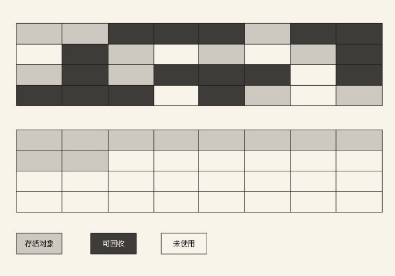

# JVM面试题
## 1. GC

### 	1.1 一个对象什么时候会被gc

简单来说，就是不可能再被任何没有别的对象引用了，自然就gc。

这就涉及到怎么判断一个对象“已死”，以下两种方法：

1.引用计数算法：

​	给对象中添加一个引用计数器，每当有一个地方引用它时，计数器值就加1；当引用失效时，计数器值就减1；任何时刻计数器为0的对象就是不可能再被使用的。

优点：实现简单、判断效率高

缺点：无法解决对象之间的相互循环引用，导致彼此无法释放。

目前虚拟机不使用这种算法。

2.可达性分析算法：

通过**一系列**的称为"GC Roots"的对象作为起始点，从这些节点开始向下搜索，搜索所走过的路径称为引用链（Reference Chain），当一个对象到GC Roots没有任何引用链相连（用图论的话来说，就是从GC Roots到这个对象不可达）时，则证明此对象是不可用的。


 一个对象不可达时，只是进入"缓刑阶段"，还是可以自救的，回收对象，对象会被标记两次，对象在第一次被标识后，会看有无必要必要执行finalize(), 如果该对象在这个方法中设置了其他引用，那它就能存活。


GC Roots的对象：

- 虚拟机栈（栈帧中的本地变量表）中引用的对象。

- 方法区中类静态属性引用的对象。

- 方法区中常量引用的对象。

- 本地方法栈中JNI（即一般说的Native方法）引用的对象


由此涉及到引用类型的分类：

- 强引用，类似"Object obj=new Object()"这类的引用。
- 软引用，用来描述一些还有用但并非必需的对象。
- 弱引用，非必需对象的。
- 虚引用，为一个对象设置虚引用关联的唯一目的就是能在这个对象被收集器回收时收到一个系统通知。


判断一个类无效：

- 不存在该类的任何实例。
- 加载该类的classLoader已经被回收。
- 该类对应的java.lang.class对象没有任何引用，无法通过反射访问该类方法。


### 	1.2 为什么要在这个时候才会被gc

### 	1.3 gc策略有哪些分类

- **标记-清除算法**

  首先标记出所有需要回收的对象，在标记完成后统一回收所有被标记的对象。

  缺点：

  (1)、效率问题，标记和清除两个过程的效率都不高。

  (2)、空间问题，标记清除之后会产生大量不连续的内存碎片，空间碎片太多可能会导致以后在程序运行过程中需要分配较大对象时，无法找到足够的连续内存而不得不提前触发另一次垃圾收集动作。

  

- **复制算法**

  为了解决上面算法的效率问题。

  将可用内存按容量划分为大小相等的两块，每次只使用其中的一块。当这一块的内存用完了，就将还存活着的对象复制到另外一块上面，然后再把已使用过的内存空间一次清理掉。这样使得每次都是对整个半区进行内存回收，内存分配时也就不用考虑内存碎片等复杂情况。

  优点：分配内存效率高，不用考虑内存碎片问题。

  缺点：将内存缩小为原来的一半，代价太高。

  ​			不适合存活率较高的对象。

  

  **合理的内存设计是： 8:1:1**

  **将内存分为：**

  - **一块较大的Eden空间**

  - **两块较小的Survivor空间。**

  **每次使用Eden和其中一块Survivor[1]。**

  **当回收时，将Eden和Survivor中还存活着的对象一次性地复制到另外一块Survivor空间上，最后清理掉Eden和刚才用过的Survivor空间。**

  **HotSpot虚拟机默认Eden和Survivor的大小比例是8:1，也就是每次新生代中可用内存空间为整个新生代容量的90%（80%+10%），只有10%的内存会被“浪费”。当然，98%的对象可回收只是一般场景下的数据，我们没有办法保证每次回收都只有不多于10%的对象存活，当Survivor空间不够用时，需要依赖其他内存（这里指老年代）进行分配担保（Handle Promotion）。**

  

  

- 标记-整理算法

  回收老年代。

  标记过程仍然与“标记-清除”算法一样，但后续步骤不是直接对可回收对象进行清理，而是让所有存活的对象都向一端移动，然后直接清理掉端边界以外的内存。

  

- 分代收集算法

  一般是把Java堆分为**新生代和老年代**，这样就可以根据各个年代的特点采用最适当的收集算法。

  在**新生代**中，每次垃圾收集时都发现有大批对象死去，**只有少量存活，那就选用复制算法**，只需要付出少量存活对象的复制成本就可以完成收集。

  而**老年代**中因为对象存活率高、没有额外空间对它进行分配担保，就必须使用**“标记—清理”或者“标记—整理”算法来进行回收**。

### 	1.4 策略的优劣势，分别适合什么场景？

​	上面问题已解决。

### 	1.5 给你一个场景，然后选择策略，为什么这么选择


## 2. 类的加载机制

### 	2.1 java类的加载器有哪些。

虚拟机角度划分：

- 启动类加载器，c++实现。
- 其他所有类加载器，java实现。

开发角度划分：

- **启动类加载器(Bootstrap ClassLoader)**，将器负责将存放在＜JAVA_HOME＞\lib目录中的，或者被-Xbootclasspath参数所指定的路径中的，并且是虚拟机识别的（仅按照文件名识别，如rt.jar，名字不符合的类库即使放在lib目录中也不会被加载）类库加载到虚拟机内存中。**开发者无法使用该加载器**。
- **扩展类加载器(Extension ClassLoader)**，负责加载＜JAVA_HOME＞\lib\ext目录中的，或者被“java.ext.dirs系统变量所指定的路径中的所有类库，**开发者可以直接使用扩展类加载器**。
- **应用程序类加载器(Application ClassLoader)**，加载用户类路径上的指定类库，**开发者可以直接使用**。


### 	2.2 类加载器之间的父子关系是怎么样。

除了启动类加载器，其他加载器都必须要有父类加载器，其中的父子关系都是使用**组合关系**来复用父类加载器代码，而**非继承**。

**啃老工作过程**：类加载器接收到类加载请求，先扔给它父类加载器，每层加载器都是如此，所以加载请求最终会被送到顶层的类加载器中，只有当父加载器无法完成加载请求，子加载器才会尝试去加载。


###  	2.3 为什么java的类加载器要使用双亲委派对象。

### 	2.4 如何自定义自己的类加载器。

###  	2.5 自定义的类加载器和java自带的类加载器关系如何处理。


## 3. 内存

### 	3.1 JVM内存分为哪几部分，这些部分分别都存储哪些数据？

内存分成 


- 内存数据区域分布内容

| 内存划分的数据区域 | 是否存在OutOfMemoryError | 含义                                                         | 是否线程私有 | 异常                                                         |
| ------------------ | ------------------------ | ------------------------------------------------------------ | ------------ | ------------------------------------------------------------ |
| 方法区             | 是                       | 所有线程共享，存储：“已被虚拟机加载的类信息、常量、静态变量、即时编译器编译后的代码等数据。垃圾收集很少发生，主要是针对常量池的回收以及对类型的卸载。包含运行时常量池，存放编译期生成的各种字面量和符号引用。 | 否           | OutOfMemoryError                                             |
| 堆                 | 是                       | java虚拟机中内存最大，所有线程共享，存放所有对象实例。垃圾收集器的主要区域，简称“gc堆”。参数-Xms -Xms控制动态拓展。 | 否           | 如果在堆中没有内存完成实例分配，并且堆也无法再扩展时，将会抛出OutOfMemoryError异常 |
| 虚拟机栈           | 是                       | 调用java 方法，每个方法调用的过程，对应一个栈帧在虚拟机栈中入栈到出栈的过程。栈帧存储局部变量表、操作数栈、动态链接、方法出口等信息 | 是           | StackOverflowError异常：线程请求的栈深度大于虚拟机所允许的深度。动态扩展时无法申请到足够的内存，就会抛出OutOfMemoryError异常 |
| 本地方法栈         | 是                       | 为虚拟机使用到的Native方法服务，本地方法调用时入栈出栈。     | 是           | 本地方法栈区域也会抛出StackOverflowError和OutOfMemoryError异常 |
| 程序计数器         | 否                       | 当前线程所执行的字节码的行号指示器; 记录的是正在执行的虚拟机字节码指令的地址 | 是           |                                                              |
- 说明：
  
 ``` 
(1). 字节码解释器：通过改变这个计数器的值来选取下一条需要执行的字节码指令，分支、循环、跳转、异常处理、线程恢复等基础功能都需要依赖这个计数器来完成。
  
(2). 线程私有的内存数据区域，生命周期与线程相同。
  
(3). 栈帧：每个方法执行的同时会创建一个栈帧，用于存储局部变量表、操作数栈、动态链接、方法出口等信息。
  
(4). OutOfMemoryError：只要内存不足，无法满足申请要求，都会报OOM。NIO中的方法会使用到直接内存，虽然直接内存不属于java虚拟机，但是也要受到本机内存的限制嘛，因此也会发生OOM.
 ```

  


### 3.2 一个对象从创建到销毁都是怎么在这些部分里存活和转移的？

虚拟机在Java堆中进行对象的分配、布局和访问全过程如下：

（1）对象创建：

```

1.遇到new关键字，先检查在常量池中是否能定位到这个类的符号引用，什么是符号引用，检查类是否被加载、解析和初始化过。
2.在java堆内存中分配空间。
3.虚拟机讲分配到的内存空间初始化为零值（0，false, null）（不包括对象头）。
4.设置对象头必要信息，例如属于哪个类实例，如何找到类的元数据信息，对象的哈希码，gc分代年龄
5.执行<init>方法，初始化（类变量的赋值和静态代码块），按照程序猿意愿。
6.执行构造方法。
7.在线程栈中设置对象引用。
   
```


（2）对象在堆内存中的布局：

​	包含3块区域：对象头（Header）、实例数据（Instance Data）和对齐填充（Padding）

- 对象头包括两部分信息，对象头部分正好是8字节的倍数（1倍或者2倍）。

​       一部分：用于存储对象自身的运行时数据，如哈希码（HashCode）、GC分代年龄、锁状态标志、线程持有的锁、偏向线程ID、偏向时间戳等。

​       一部分：是类型指针，即对象指向它的类元数据的指针，虚拟机通过这个指针来确定这个对象是哪个类的实例。

- 实例数据部分：对象真正存储的有效信息，也是在程序代码中所定义的各种类型的字段内容。无论是从父类继承下来的，还是在子类中定义的，都需要记录起来。

- 对齐填充：    并不是必然存在的，也没有特别的含义，它仅仅起着占位符的作用，对象的大小必须是8字节的整数倍。

  

（4）访问: 使用句柄和直接指针

- 句柄访问：

​	Java堆中将会划分出一块内存来作为句柄池，reference中存储的就是对象的句柄地址，而句柄中包含了对象实例数据与类型数据各自的具体地址信息

​	**优势**：在reference中是稳定的句柄地址，垃圾回收的时候，对象经常会被移动，因此只需要改变聚句柄中实例数据指针。


- **直接指针访问**：

​		Java堆对象的布局中就必须考虑如何放置访问类型数据的相关信息，而reference中存储的直接就是对象地址。

​	**优势**：速度快，节省一次指针定位的时间开销，特别是访问对象如此频繁的场景，执行成本节省效果很客观，平时用到的虚拟机是使用直接指针访问。


​	

（4）**销毁**：

​	对象完成使命后，等待GC进行垃圾回收。销毁对象即清理对象所占用的内存空间，会调用对象的finalize()方法。


### 3.3 内存的哪些部分会参与GC的回收？

​    堆，方法区（永久代，较少发生）

### 3.4 Java的内存模型是怎么设计的？

### 3.5 为什么要这么设计？


## 4. 多线程

### 4.1 结合内存模型的设计谈谈**volatile**关键字的作用？

​	**volatile是java虚拟机提供的最轻量级的同步机制！**

​	两种特性：

​		1.**可见性**，保证被修饰的变量被所有线程可见，何为可见性，一条线程修改了某个变量的值，新值立马被其他线程得知，原因（后续增加）。

​		 <u>volatile变量是线程安全的，但是 volatile变量运算在并发情况下就不安全了。使用场景，例如不需要进行运算，只是作为状态改变来控制并发的情况，boolean值。</u>

​		2. **禁止指令重排序优化**，虽然重排，但是线程内变现还是串行语义（比如线程内是2*3+6，指令重排只是提高cpu的使用效率，并不会变成2*6+3)


我们继续深入扒一下。


### 4.2 为啥**volatile**修饰的变量能实现可见性？

​	volatile修饰的变量在被执行赋值语句时，赋值操作“mov %eax，0下50（%esi）”结束后，会多执行一个 “lock add1 $0x0, (%esp)”，而这个空操作就如同一个内存屏障，作用就是使得本cpu的cache写入到内存，同时引起别的cpu的cache无效，从而使得volatile变量的修改对其他cpu立刻可见。


### 4.3 为啥**volatile**修饰了就能避免指令重排序？

​	如同上面讲的，重排序在运算结果上面来说还是有序的，在硬件程度，指令重排序是指cpu不按程序规定的顺序分开发送给各相应的电路板执行，但是指令之间还是会存在顺行的依赖以保证得到正确的运算结果。 “lock add1 $0x0, (%esp)”这个操作就把所有之前的操作全部执行完成了，写到了内存中，后续指令再怎么重排序也是没用的，这就是所谓的“内存屏障”。


### 4.4 java**内存模型对**volatile变量定义的特殊规则：

​	1.工作内存中，线程每次使用volatile变量，必须先从主内存中刷新获取最新的值。

​	2.工作内存中，线程每次修改volatile变量的值，必须立刻同步回主内存中，保证其他线程对其修改的内容可见。

肯定会提到可见性，那么接着可见性这三个字，还可以继续问你并发的内容

### 4.5 Java**内存模型， **jvm内存模型分别是什么？有什么区别？

- Java内存模型可以理解为：**在特定的操作协议下，对特定的内存或者告诉缓存进行读写访问的过程抽象**，也就是告诉我们java是按照什么的规则去读写内存的。它屏蔽掉各种硬件和操作系统的内存访问差异，以实现让java程序在各种平台下达到一致的内存访问效果，以及如何解决各种竞争问题。

- java内存模型的目标：定义程序中的各个变量的访问规则，虚拟从内存中读取吸入变量的底层细节。

- 主内存：并非硬件含义上的内存，而是虚拟机内分配的一部分内存。

- 工作内存： 每个线程都有自己的工作内存，保存了该线程用到的变量的主内存副本拷贝（不是整个对象拷贝，被访问到的地方才拷贝）。

- 线程对变量的操作，必须是在工作内存中进行，不能直接读写主内存中的变量，**volatile**依然有工作内存拷贝，只是由于特殊性，呈现的效果如同从主内存中读写访问一般。


- 说明：

  这个图中主内存，工作内存和java的堆、栈、方法区并不是同一层次的内存划分，**基本没有关系**。

  从变量、主内存、工作内存定义来看。

  **主内存    —> 	java堆中的对象实例数据部分，堆还保存很多其他对象信息。**

  **工作内存 —>	 java虚拟机栈中的部分区域。**
  
  主内存，实际上可以类比硬件上的内存条，但是又不完全是，因为硬件的内存条还储存了其他信息，上面有一部分是java虚拟机内存，而这个主内存也是虚拟机内存的一部分，存储着java的全部对象实例数据，但是java线程不能直接更改，只能够是先拷贝一份到自己的工作内存中，进行修改，然后再同步回主内存中。
  
  工作内存类比高速缓存，保存着java线程的工作信息。

