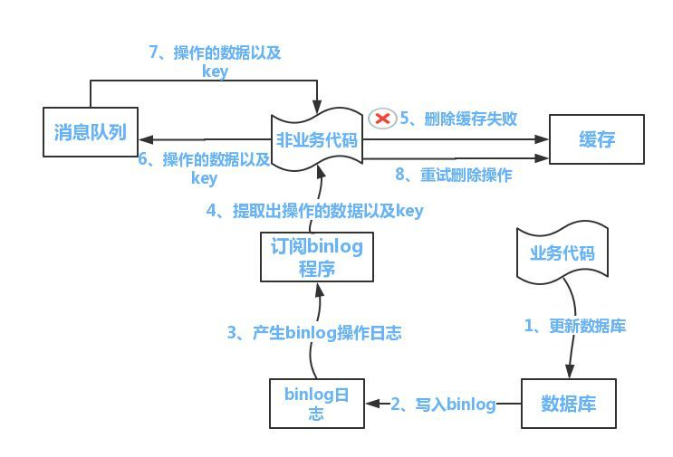

## 分布式篇

####1.分布式系统

####2.CAP理论

####3.BASE理论

####4.如何保证幂等

​	分布式锁，保证一个线程操作。
​    1.一个订单不允许被多次支付（包括并发状态下不允许被多个人同时支付）
​    下单前对订单状态（status字段）校验，对订单加上乐观锁（加上一个字段lock），只有加锁成功的人才能进行支付。
​    或者针对每个订单生成唯一支付日志，保证一个未支付的订单只允许被一个线程支付。
​		2.库存扣减，不允许超卖。
​    需要考虑场景，在c端展示层，读取缓存的方式，如果库存扣减了，消息异步更新缓存。
​    在对库存更改的时候，使用分布式锁，锁住某个产品id的库存，只允许一个线程去更改。

#### 5.raft算法和zk选主算法
​	6.1 raft算法
​    https://zhuanlan.zhihu.com/p/28560167
​    Raft 解决的问题很简单，就是让多个副本的日志数据达成一致。选举过半即能成为leader,然后和follower保持心跳，
​    过程大概是 candidate（候选人） 发起投票，follower 可以投同意票，也可以投反对票。过半的 follower 同意，则 candidate 当选为 leader。
​    显然，这样每一届选举，只能选出一个 leader。过期的leader说话无效。
​    拜占庭将军问题，m叛徒，n总人数， n>3m, 保证一致性。
​	6.2 zk选主算法
​    https://zhuanlan.zhihu.com/p/27335748

####6.如何保证分布式缓存的一致性

https://cloud.tencent.com/developer/article/1154683

先更新数据库，再删除缓存。（facebook都在用的方法）

删除缓存失败，通过canal中间件订阅mysql binlog，进行删除缓存，

若缓存删除失败，丢到消息队列进行充实即可。

#### 7.分布式session实现

Redis存储用户生成的sessionId或者存储保存sessionId的cookie

https://juejin.im/post/5dce3f83e51d4507f87d07a6

