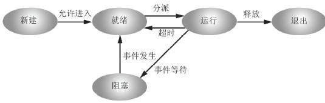
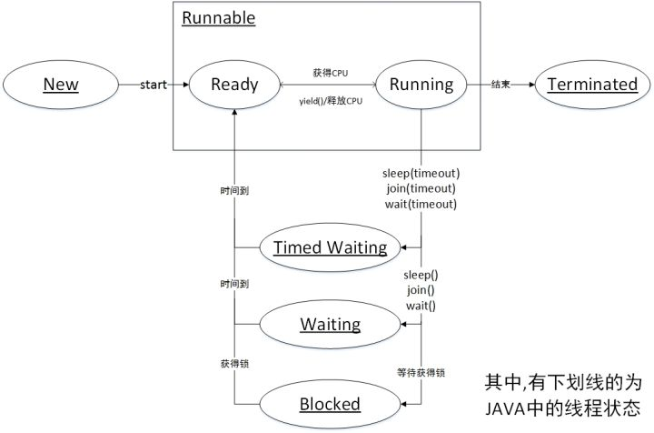
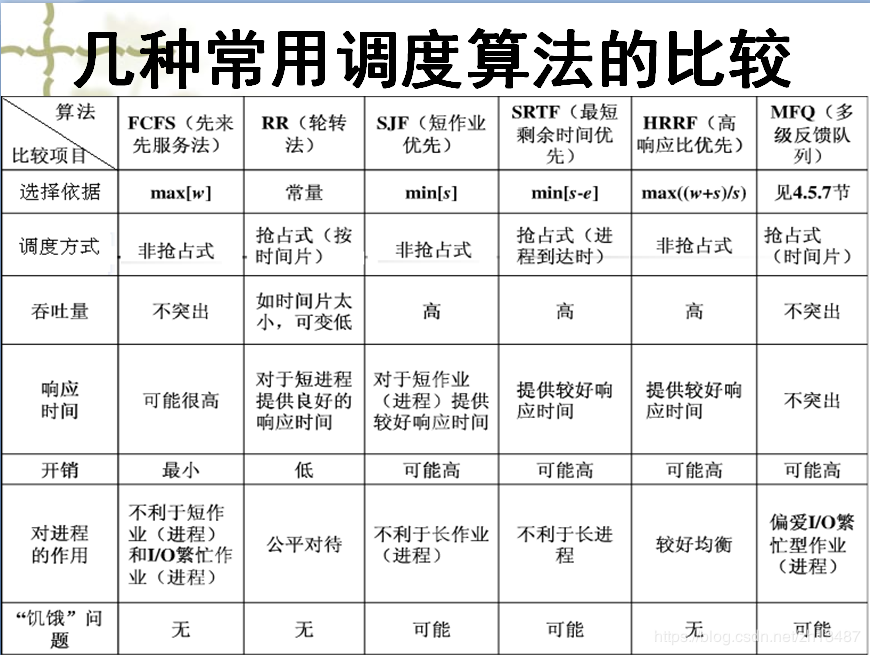

多线程篇：

##### 1.操作系统的线程和java线程状态有何区别？

操作系统线程状态：

​	新建

​	1.就绪

​	2.运行

​	3.阻塞

​	退出

jvm线程状态：

​	1.New

​	2.Runnable(Ready、Running)

​	3.Wating

​	4.Timed Waiting

​	5.Blocked

​	6.Terminated

##### 2.进程调度和线程调度的区别？

​	定义：

​		进程：进程是系统进行资源分配和调度的一个独立单位。

​		线程：CPU调度和分派的基本单位, 只拥有一点在运行中必不可少的资源(如程序计数器,一组寄存器和栈), 可共					享进程所拥有的全部资源。

线程调度：使用相同资源的`struct task_struct`之间的调度。

进程调度：使用不同资源的`struct task_struct`之间的调度。

​	区别：

1. 切换时的上下文开销。

2. 任务调度而导致的TLB不命中，缺页而导致的开销。

任务调度的主要开销：

1.  CPU执行任务调度的开销，主要是进程上下文切换的开销。
2.  任务调度后，CPU Cache/TLB不命中，导致缺页中断的开销。

上下文切换其实线程和进程差不多，但是由于线程是共享资源所以TLB不会变，但是恰恰相反进程的调度进程调度是不同资源的，很可能导致缺页，所以开销很大。

##### 3.线程的调度算法有哪些？

1.FCFS，先来先服务调度算法

2.短作业优先调度算法（抢占式/非抢占式）

3.高优先权优先调度算法

4.基于时间片轮转调度算法

https://blog.csdn.net/zh13487/article/details/83928284

##### 4.多线程如何在多个CPU上分布

通过cpu调度算法，如果运算量不大，则分配到同一个cpu进行切换运行多线程；反之，则多个cpu运行多线程。

##### 5.Thread Local的原理与适用场景

ThreadLocal 提供了线程本地的实例。它与普通变量的区别在于，每个使用该变量的线程都会初始化一个完全独立的实例副本。ThreadLocal 变量通常被`private static`修饰。当一个线程结束时，它所使用的所有 ThreadLocal 相对的实例副本都可被回收。

场景：**ThreadLocal 适用于每个线程需要自己独立的实例且该实例需要在多个方法中被使用，也即变量在线程间隔离而在方法或类间共享的场景**

    1.看周阳视频
    2.乐观锁与悲观锁的区别？
    1.乐观锁：假设最好情况，每次线程去拿数据的时候，认为别人是不会改变的，不加锁，操作完，更新数据，检查有没有人更新过，通过版本号控制，cas算法实现。
        优点：
            1.多用于读取的应用类型，提高吞吐量。
        场景：多用于读场景
    
    2.悲观锁：假设最坏情况，每次拿数据，都得上锁，认为被人会修改。独占锁，
        例如共享资源，只允许一个线程使用，阻塞。像sychronized, reentrantlock都是悲观锁的思想。
        优点：安全
        场景：多用于写场景
    
    CAS与synchronized的使用情景：
        1.CAS适用于写比较少的情况下（多读场景，冲突一般较少）
            1.cas基于硬件实现的原语操作，不需要进入内核，不需要切换线程，写少，冲突少，自旋少，高性能。
    
            2.对于资源竞争严重（线程冲突严重）的情况，CAS自旋的概率会比较大，从而浪费更多的CPU资源，效率低于synchronized。
    
        2.synchronized适用于写比较多的情况下（多写场景，冲突一般较多）
            synchronized的底层实现主要依靠 Lock-Free 的队列，基本思路是 自旋后阻塞，竞争切换后继续竞争锁，稍微牺牲了公平性，但获得了高吞吐量。在线程冲突较少的情况下，可以获得和CAS类似的性能；而线程冲突严重的情况下，性能远高于CAS。

    3.什么是cas算法，什么事版本号控制？
    版本号控制：
        数据表中加入一个version字段，表示数据被修改的次数，线程a更新值，同时会拿到version值，
        提交更新，version要等于刚才取出来的version值，否则就会一直重试。
        数据库：更新要提交版本大于当前版本才能执行更新 乐观锁。
    
    cas(比较与交换)：
        有名的无锁算法，即使不加锁，也能实现多线程之间变量的同步。
        CAS算法涉及到三个操作数：
            1.需要读写的内存值 V
            2.进行比较的值 A
            3.拟写入的新值 B
        当且仅当 V 的值等于 A时，CAS通过原子方式用新值B来更新V的值，否则不会执行任何操作（比较和替换是一个原子操作）。一般情况下是一个自旋操作，即不断的重试。
    
        缺点：
            1.ABA问题：b线程可能把值改了又改回去，a线程是无法感知的。
              解决办法，加个版本号，jdk1.5 atiomicStampedReference 当前引用是否等于预期引用，当前标志是否等于预期标志。
            2.循环时间开销大：
              自旋CAS（也就是不成功就一直循环执行直到成功）如果长时间不成功，会给CPU带来非常大的执行开销
            3.只能保证一个共享变量的原子性，当操作涉及跨多个共享变量时 CAS 无效。
                从 JDK 1.5开始，提供了AtomicReference类来保证引用对象之间的原子性，你可以把多个变量放在一个对象里来进行 CAS 操作.所以我们可以使用锁或者利用AtomicReference类把多个共享变量合并成一个共享变量来操作。

    4.什么是线程？
    线程是操作系统能够进行运算调度的最小单位，它被包含在进程之中，是进程中的实际运作单位，可以使用多线程对进行运算提速。
    
    5.什么是线程安全和线程不安全？
    加锁的就是是线程安全的，不加锁的就是是线程不安全的。
    
    6.什么是自旋锁？
    自旋锁是SMP架构中的一种low-level的同步机制。
    当线程A想要获取一把自选锁而该锁又被其它线程锁持有时，线程A会在一个循环中自选以检测锁是不是已经可用了。
    注意：
        1.由于自旋时不释放CPU，因而持有自旋锁的线程应该尽快释放自旋锁，否则等待该自旋锁的线程会一直在那里自旋，这就会浪费CPU时间。
        2.持有自旋锁的线程在sleep之前应该释放自旋锁以便其它线程可以获得自旋锁。
    实现：
    public class MyWaitNotify3{
        MontiorObject myMonitorObject = new MonitorObject();
        boolean wasSignalled = false;
    
        public void doWait(){
            sychronized(myMonitorObject){
                while(!wasSignalled){
                    try{
                        myMonitorObject.wait();
                    }catch(InterruptedException e){...}
                }
                
            }
        }
    
        public  void doNotify(){
            synchronized(myMonitorObject){
              wasSignalled = true;
              myMonitorObject.notify();
            }
        }
    }
    
    7.什么是Java内存模型？
    Java内存模型描述了在多线程代码中哪些行为是合法的，以及线程如何通过内存进行交互。它描述了“程序中的变量“ 和 ”从内存或者寄存器获取或存储它们的底层细节”之间的关系。Java内存模型通过使用各种各样的硬件和编译器的优化来正确实现以上事情。
    
    8.ThreadPool（线程池）用法与优势？
        线程池的基本思想是一种对象池，在程序启动时就开辟一块内存空间，里面存放了众多(未死亡)的线程，
        池中线程执行调度由池管理器来处理。当有线程任务时，从池中取一个，执行完成后线程对象归池，
        这样可以避免反复创建线程对象所带来的性能开销，节省了系统的资源
    1.使用场景：
        1.单个任务处理时间比较短。
        2.需要处理的任务数量很大。
    2.好处：
        1.降低资源消耗，通过重复利用已创建的线程降低线程创建和销毁造成的消耗。
        2.提高响应速度，当任务到达，不需要等到线程创建就能立刻执行。
        3.提高线程的可管理性，线程池可以统一分配线程资源，调优和监控。比如：延时执行、定时循环执行的策略等

    怎么才算是阻塞，具体表现是怎么样，会消耗系统资源吗
    https://zhuanlan.zhihu.com/p/34678757
    什么是AQS？
    什么是原子操作？在Java Concurrency API中有哪些原子类(atomic classes)？
    什么是Executors框架？
    什么是阻塞队列？如何使用阻塞队列来实现生产者-消费者模型？
    什么是Callable和Future?
    什么是FutureTask?
    什么是同步容器和并发容器的实现？
    什么是多线程？优缺点？
    什么是多线程的上下文切换？
    ThreadLocal的设计理念与作用？
    
    Concurrent包里的其他东西：ArrayBlockingQueue、CountDownLatch等等。
    synchronized和ReentrantLock的区别？
    Semaphore有什么作用？
    Java Concurrency API中的Lock接口(Lock interface)是什么？对比同步它有什么优势？
    Hashtable的size()方法中明明只有一条语句”return count”，为什么还要做同步？
    ConcurrentHashMap的并发度是什么？
    ReentrantReadWriteLock读写锁的使用？
    CyclicBarrier和CountDownLatch的用法及区别？
    LockSupport工具？
    Condition接口及其实现原理？
    Fork/Join框架的理解?
    wait()和sleep()的区别?
    线程的五个状态（五种状态，创建、就绪、运行、阻塞和死亡）?
    start()方法和run()方法的区别？
    Runnable接口和Callable接口的区别？
    volatile关键字的作用？
    Java中如何获取到线程dump文件？
    线程和进程有什么区别？
    线程实现的方式有几种（四种）？
    高并发、任务执行时间短的业务怎样使用线程池？并发不高、任务执行时间长的业务怎样使用线程池？并发高、业务执行时间长的业务怎样使用线程池？
    如果你提交任务时，线程池队列已满，这时会发生什么？
    锁的等级：方法锁、对象锁、类锁?
    如果同步块内的线程抛出异常会发生什么？
    并发编程（concurrency）并行编程（parallellism）有什么区别？
    如何保证多线程下 i++ 结果正确？
    一个线程如果出现了运行时异常会怎么样?
    如何在两个线程之间共享数据?
    生产者消费者模型的作用是什么?
    怎么唤醒一个阻塞的线程?
    Java中用到的线程调度算法是什么
    单例模式的线程安全性?
    线程类的构造方法、静态块是被哪个线程调用的?
    同步方法和同步块，哪个是更好的选择?
    如何检测死锁？怎么预防死锁？
    
    4.sychronized?
    https://juejin.im/post/5c936018f265da60ec281bcb
        可以发现synchronized同步代码块是通过加monitorenter和monitorexit指令实现的。
        每个对象都有个**监视器锁(monitor) **，当monitor被占用的时候就代表对象处于锁定状态，而monitorenter指令的作用就是获取monitor的所有权，monitorexit的作用是释放monitor的所有权，这两者的工作流程如下：
        monitorenter：
        
        如果monitor的进入数为0，则线程进入到monitor，然后将进入数设置为1，该线程称为monitor的所有者。
        如果是线程已经拥有此monitor(即monitor进入数不为0)，然后该线程又重新进入monitor，则将monitor的进入数+1，这个即为锁的重入。
        如果其他线程已经占用了monitor，则该线程进入到阻塞状态，知道monitor的进入数为0，该线程再去重新尝试获取monitor的所有权。
        
        monitorexit：执行该指令的线程必须是monitor的所有者，指令执行时，monitor进入数-1，如果-1后进入数为0，那么线程退出monitor，不再是这个monitor的所有者。这个时候其它阻塞的线程可以尝试获取monitor的所有权。
    
    5.reentrantlock?
    6.各种锁
    
    

​    操作系统线程和java线程状态有何区别？

------------------------------------------------------------

操作系统篇：

    1.内存管理
    2.进程管理
    3.文件系统
    4.select、poll、epoll之间的区别？
        https://www.cnblogs.com/anker/p/3265058.html
        1.select，poll，epoll都是IO多路复用的机制。I/O多路复用就通过一种机制，可以监视多个描述符，
        一旦某个描述符就绪（一般是读就绪或者写就绪），能够通知程序进行相应的读写操作。
    
        2.select，poll，epoll本质上都是同步I/O，因为他们都需要在读写事件就绪后自己负责进行读写，也就是说这个读写过程是阻塞的。

